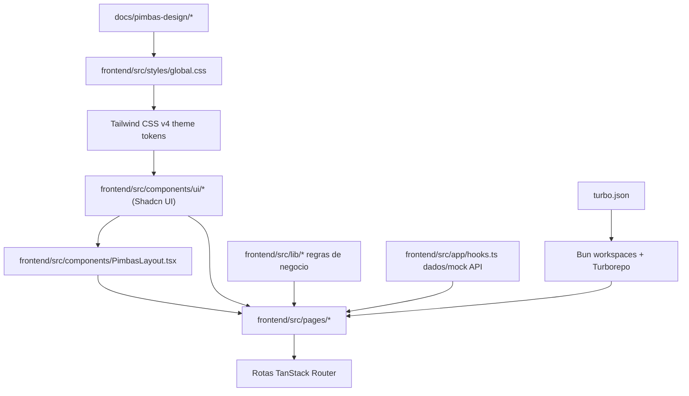

# Pimbas UI System Design

Documento de referencia para manter a qualidade visual e tecnica da interface do Pimbas apos a migracao para Tailwind CSS + Shadcn UI.

## Resumo

A aplicacao foi migrada de CSS puro, concentrado em `frontend/src/styles/global.css`, para uma arquitetura de interface baseada em:

- Tailwind CSS v4 como linguagem de layout e utilitarios.
- Shadcn UI, estilo `base-nova`, como biblioteca de componentes versionados dentro do projeto.
- Base UI como primitiva de acessibilidade usada pelos componentes Shadcn gerados.
- Tokens Pimbas em CSS custom properties, mapeados para tokens semanticos do Shadcn.
- Componentes de composicao do dominio em `frontend/src/components/PimbasLayout.tsx`.
- Turborepo na raiz para orquestrar tarefas do pacote `@pimbas/frontend` e permitir novos pacotes no futuro sem escolher agora a tecnologia do backend.

O objetivo nao foi trocar a identidade visual. O objetivo foi preservar a personalidade "boteco + medalha de campeonato" do design original e transformar essa identidade em um sistema reutilizavel para as demais areas.

## Evidencias

Arquivos usados como base da documentacao:

- `docs/pimbas-design.md`
- `docs/pimbas-design/readme.md`
- `docs/pimbas-design/tokens/colors.css`
- `frontend/src/styles/global.css`
- `frontend/components.json`
- `frontend/src/components/ui/*`
- `frontend/src/components/PimbasLayout.tsx`
- `frontend/src/components/AppShell.tsx`
- Telas em `frontend/src/pages/*`
- `package.json`
- `turbo.json`
- `frontend/package.json`

Comandos executados na migração:

```bash
bun run typecheck
bun run test
bun run lint
bun run build
```

Resultado observado:

- Typecheck: passou.
- Testes: passaram, 8 testes em 3 arquivos.
- Lint: passou com 3 warnings em arquivos Shadcn gerados por exportarem helpers alem de componentes.
- Build: passou.
- Dev server: respondeu `200 OK` em `http://127.0.0.1:5173/`.

Observacao operacional: em alguns comandos, Vite/Vitest falharam dentro do sandbox por `Acesso negado` ao carregar `vite.config.ts`; os mesmos comandos passaram fora do sandbox.

## Diagnostico

Antes da migracao, a interface dependia de uma folha CSS grande, com muitas classes globais como `page`, `section`, `wide-button`, `segmented`, `player-chip`, `team-card`, `bottom-nav` e outras. Isso funcionava para o prototipo, mas criava riscos:

- regras visuais espalhadas por seletores globais;
- maior chance de conflitos ao criar novas telas;
- menor rastreabilidade entre design system e implementacao;
- formularios, botoes, badges e navegacao sem uma API padronizada de componentes;
- maior custo para evoluir acessibilidade, estados e variantes.

A migracao reduz esse risco ao mover a base visual para tokens e componentes compostos.

## Arquitetura Atual



### Camadas

| Camada | Responsabilidade | Arquivos |
| --- | --- | --- |
| Referencia visual | Define identidade, tom, tokens originais e exemplos visuais. | `docs/pimbas-design/*` |
| Orquestracao | Define workspaces Bun + tarefas Turborepo. | `package.json`, `turbo.json` |
| Pacote frontend | Contem o app React/Vite atual. | `frontend/package.json` |
| Tema global | Expoe tokens Pimbas e tokens Shadcn/Tailwind. Mantem apenas estilos base globais. | `frontend/src/styles/global.css` |
| Componentes base | Componentes Shadcn instalados como codigo do projeto. | `frontend/src/components/ui/*` |
| Componentes de dominio | Compoe componentes base com identidade Pimbas. | `frontend/src/components/PimbasLayout.tsx` |
| Telas | Montam fluxos do produto usando componentes e regras existentes. | `frontend/src/pages/*` |
| Regras e dados | Mantem regras funcionais fora da UI. | `frontend/src/lib/*`, `frontend/src/app/hooks.ts`, `frontend/src/mocks/*` |

## Decisoes de Design

### 1. Preservar identidade, trocar a base tecnica

Fato observado: o pacote `docs/pimbas-design` ja definia a identidade do Pimbas com papel creme, verde feltro, terracota, ouro, Anton e Archivo.

Decisao: manter essa direcao visual e apenas traduzi-la para Tailwind/Shadcn.

Impacto: novas telas ficam consistentes sem copiar CSS antigo.

### 2. Usar tokens semanticos primeiro

Fato observado: Shadcn espera tokens como `--background`, `--foreground`, `--primary`, `--card`, `--muted`, `--border` e `--ring`.

Decisao: mapear os tokens Pimbas para tokens semanticos em `frontend/src/styles/global.css`.

| Token Pimbas | Token semantico | Uso |
| --- | --- | --- |
| `--pmb-paper-soft` | `--background` | fundo geral |
| `--pmb-ink` | `--foreground` | texto principal |
| `--pmb-white` | `--card` | cards e superficies elevadas |
| `--pmb-felt` | `--primary` | acoes principais, headers e navegacao ativa |
| `--pmb-paper-soft` | `--primary-foreground` | texto sobre verde |
| `--pmb-gold` | `--ring` | foco visivel |
| `--pmb-clay` | uso de dominio | status, energia, acoes de jogo |

### 3. Separar componentes base de componentes de dominio

Fato observado: Shadcn fornece componentes genericos, mas o Pimbas precisa de padroes proprios: header verde com textura de hastes, badge de tipo de partida, avatar redondo de jogador e card de secao.

Decisao: criar `frontend/src/components/PimbasLayout.tsx` como camada de composicao do dominio.

| Componente | Uso |
| --- | --- |
| `Page` | Container padrao de tela, mobile-first, com largura maxima e padding responsivo. |
| `PageHeader` | Header verde com textura `--field-rods`, opcionalmente hero ou dark. |
| `Eyebrow` | Label curta em dourado, usada para contexto de tela/secao. |
| `PimbasAvatar` | Avatar com imagem opcional, fallback obrigatorio e tamanhos padronizados. |
| `KindBadge` | Badge para `friendly` e `tournament`. |
| `LiveBadge` | Badge animado de partida ao vivo. |
| `SurfaceCard` | Card simples para conteudo solto ou vazio. |
| `SectionCard` | Card de secao com titulo e acao opcional. |

### 4. Manter regras de negocio fora da UI

Fato observado: regras de partida, ranking e torneio ja estavam em `frontend/src/lib`.

Decisao: a migracao nao alterou regras como:

- partida 2v2;
- limite de gols;
- tempo e gol de ouro;
- ranking;
- chaveamento de torneio;
- bye;
- disputa de terceiro lugar.

Impacto: baixo risco funcional. A mudanca foi majoritariamente visual e estrutural de UI.

## Guia de Implementacao para Novas Telas

### Estrutura recomendada

Use esta composicao como ponto de partida:

```tsx
import { Page, PageHeader, Eyebrow, SectionCard } from "@/components/PimbasLayout"
import { Button } from "@/components/ui/button"

export function MinhaTela() {
  return (
    <Page>
      <PageHeader>
        <Eyebrow>Contexto</Eyebrow>
        <h1 className="font-display text-3xl uppercase leading-none">Titulo da tela</h1>
        <p className="mt-1 text-sm text-primary-foreground/80">Descricao curta.</p>
      </PageHeader>

      <SectionCard title="Secao">
        <Button>Acao principal</Button>
      </SectionCard>
    </Page>
  )
}
```

### Regras de composicao

- Use `Page` em toda tela roteada.
- Use `PageHeader` quando a tela tiver titulo principal.
- Use `SectionCard` para blocos de conteudo de negocio.
- Use componentes Shadcn antes de criar markup customizado.
- Use `Button` para acoes.
- Para links com aparencia de botao, use `buttonVariants`.
- Use `Badge` ou `KindBadge` para status e categorias.
- Use `Avatar` via `PimbasAvatar`, sempre com fallback e `alt` quando houver imagem.
- Use `ToggleGroup` para opcoes de 2 a 7 escolhas.
- Use `FieldGroup`, `Field`, `FieldLabel`, `Input`, `Switch` e `FieldError` para formularios.
- Use `cn()` para classes condicionais.

### Regras de Tailwind

- Prefira tokens semanticos: `bg-background`, `text-foreground`, `bg-card`, `text-muted-foreground`, `bg-primary`.
- Evite cores cruas como `bg-green-700` em telas. Quando a cor for especifica da marca, use `var(--pmb-*)`.
- Use `gap-*` para espacamento entre itens.
- Evite `space-x-*` e `space-y-*`.
- Use `size-*` quando largura e altura forem iguais.
- Use `truncate` quando precisar cortar texto em uma linha.
- Use classes responsivas explicitas: `md:*`, `lg:*`, `max-[520px]:*`.
- Nao recrie CSS global para uma tela especifica.

### Formularios

Padrao correto:

```tsx
<FieldGroup>
  <Field data-invalid={hasError}>
    <FieldLabel htmlFor="goal-limit">Gols</FieldLabel>
    <Input id="goal-limit" aria-invalid={hasError} />
    {hasError && <FieldError>Informe pelo menos 1 gol.</FieldError>}
  </Field>
</FieldGroup>
```

Nao use `label` solto com `input` cru em novas telas.

### Botoes com icones

Padrao correto:

```tsx
<Button>
  <Plus data-icon="inline-start" />
  Criar torneio
</Button>
```

Nao adicione `size-*` no icone dentro do `Button`, salvo quando o componente nao controlar o tamanho.

### Tabs, filtros e segmentos

Use `ToggleGroup`:

```tsx
<ToggleGroup value={[tab]} onValueChange={(value) => value[0] && setTab(value[0])}>
  <ToggleGroupItem value="players">Jogadores</ToggleGroupItem>
  <ToggleGroupItem value="pairs">Duplas</ToggleGroupItem>
</ToggleGroup>
```

Observacao: nesta base Shadcn/Base UI, o valor controlado do `ToggleGroup` e um array de strings.

## Padroes Visuais

### Imagens de jogadores e grupos

O prototipo usa presets locais em `frontend/public/presets`.

| Tipo | Fonte | Contrato |
| --- | --- | --- |
| Jogador | `frontend/public/presets/players/*.svg` | `PlayerProfile.avatarUrl` e `PlayerProfile.avatarPresetId` |
| Grupo | `frontend/public/presets/groups/*.svg` | `Group.logoUrl` e `Group.logoPresetId` |
| Catalogo | `frontend/src/lib/mediaPresets.ts` | listas `playerAvatarPresets` e `groupLogoPresets` |

No produto real, a tela de edicao deve permitir duas origens:

1. selecionar uma imagem pronta do catalogo de presets;
2. enviar uma imagem propria, armazenada pelo backend/storage futuro e exposta como URL.

Regra de UI: sempre renderizar imagem por `PimbasAvatar` e manter iniciais como fallback para erro de carregamento, usuario anonimo ou grupo sem logo.

### Paleta

| Papel | Token | Uso |
| --- | --- | --- |
| Creme claro | `--pmb-paper-soft` | fundo geral e texto sobre verde |
| Papel | `--pmb-paper` | avatar, superficies secundarias |
| Verde feltro | `--pmb-felt` | marca, headers, ativo, time verde |
| Verde profundo | `--pmb-felt-deep` | profundidade de superficie verde |
| Terracota | `--pmb-clay` | torneio, energia, time laranja |
| Ouro | `--pmb-gold` | foco, rating, medalha, destaque |
| Tinta | `--pmb-ink` | texto principal |

### Tipografia

- `font-display`: Anton, para titulos, placares, ratings e labels curtas.
- `font-sans`: Archivo, para texto de interface.

Regras:

- Titulos de tela usam `font-display`, caixa alta e `leading-none`.
- Texto corrido nao deve usar caixa alta.
- Numeros esportivos podem usar `font-display`.

### Assinatura visual

O elemento mais caracteristico do Pimbas e a textura `--field-rods`, que remete as hastes da mesa de pimbolim.

Use em:

- headers verdes;
- tela de partida ao vivo;
- ficha do jogador;
- superficies que representam campo/jogo.

Evite usar em:

- cards de dados comuns;
- formularios;
- listas densas;
- modais.

## Mapa de Telas Migradas

| Tela | Padroes aplicados |
| --- | --- |
| `GroupHome` | `Page`, `PageHeader`, `PimbasAvatar`, `Button`, `Card`, `KindBadge`, `LiveBadge`, `SectionCard`. |
| `NewFriendly` | `FieldGroup`, `Field`, `Input`, `Switch`, `Button`, selecao de jogadores com `PimbasAvatar`. |
| `LiveMatch` | Tela verde full-context, `Button`, `KindBadge`, placar com `ScoreBadge`, acoes rapidas por jogador. |
| `History` | `ToggleGroup`, `KindBadge`, cards de partida. |
| `Ranking` | `ToggleGroup`, podium, `PimbasAvatar`, listas responsivas. |
| `PlayerProfile` | Card esportivo com textura, estatisticas em cards, duplas frequentes. |
| `Tournaments` | Formulario Shadcn, selecao de jogadores, listagem com `KindBadge`. |
| `TournamentBracket` | Bracket responsivo com `Badge`, `SectionCard` e estados de matchup. |
| `AppShell` | Navegacao principal responsiva com Tailwind e icones Lucide. |

## Qualidade e Validacao

Antes de finalizar qualquer mudanca visual relevante, execute:

```bash
npm.cmd run typecheck
npm.cmd test
npm.cmd run lint
npm.cmd run build
```

Checklist manual recomendado:

- Abrir home do grupo em mobile e desktop.
- Criar partida amistosa com exatamente 4 jogadores.
- Validar erro ao tentar torneio com numero impar de jogadores.
- Registrar gol na partida ao vivo.
- Encerrar partida.
- Verificar historico, ranking e ficha do jogador.
- Abrir bracket de torneio.
- Conferir foco visivel via teclado em botoes e links.
- Conferir que textos longos quebram linha sem estourar cards.

## Impacto

Classificacao: medio.

Motivos:

- A migracao alterou a camada visual de varias telas.
- Regras de negocio foram preservadas.
- Nao houve mudanca de banco de dados, API, autenticacao ou autorizacao.
- Foram adicionadas dependencias de UI e build.

| Area | Impacto | Observacao |
| --- | --- | --- |
| Usuarios | Medio | Aparencia e ergonomia mudaram, fluxos foram preservados. |
| Regras de negocio | Baixo | Regras em `frontend/src/lib` nao foram alteradas. |
| Banco de dados | Nenhum | Projeto segue mockado em memoria. |
| APIs | Nenhum | Hooks e mock API foram preservados. |
| Telas | Medio | Classes antigas foram substituidas por Tailwind/Shadcn. |
| Seguranca | Baixo | Sem novos endpoints, sem auth, sem armazenamento sensivel. |
| Performance | Baixo/medio | CSS final inclui Tailwind e componentes Shadcn; build passou. |
| Testes | Baixo | Testes unitarios existentes continuam passando. |

## Riscos

| Risco | Severidade | Evidencia | Mitigacao |
| --- | --- | --- | --- |
| Divergencia entre tokens do pacote `docs/pimbas-design` e `frontend/src/styles/global.css`. | Media | Existem tokens em ambos os lugares. | Manter este documento como ponte e revisar tokens ao alterar identidade. |
| Uso indevido de cores cruas em novas telas. | Media | Tailwind facilita classes ad hoc. | Preferir tokens semanticos e `var(--pmb-*)`. |
| Reintroducao de CSS global por tela. | Media | O projeto vinha de CSS puro global. | Criar componentes de dominio ou usar `className` local com Tailwind. |
| Warnings de Fast Refresh em arquivos Shadcn. | Baixa | `button.tsx`, `badge.tsx`, `toggle.tsx` exportam helpers. | Aceitar como padrao Shadcn ou separar helpers se virar requisito de lint zero-warning. |
| Mudanca futura de preset Shadcn sobrescrever customizacoes. | Media | `components.json` usa `base-nova`. | Nunca usar `--overwrite` sem revisar diff. |

## Regras para Evolucao

1. Nao altere tokens globais sem avaliar todas as telas.
2. Nao adicione biblioteca visual nova sem justificativa.
3. Nao copie componentes Shadcn manualmente de GitHub; use o CLI.
4. Nao use `--overwrite` em componentes Shadcn sem aprovacao humana.
5. Componentes de dominio devem compor `frontend/src/components/ui`, nao duplicar implementacao base.
6. Regras de negocio devem ficar em `frontend/src/lib` ou camada de dados, nao em componentes visuais.
7. Toda nova tela deve ser mobile-first.
8. Toda acao interativa precisa de estado disabled/loading quando aplicavel.
9. Todo avatar deve ter fallback.
10. Todo formulario deve ter label associada e erro acessivel.

## Como Adicionar um Novo Componente Shadcn

1. Consultar contexto:

```bash
npx.cmd shadcn@latest info --json
```

2. Consultar documentacao do componente:

```bash
npx.cmd shadcn@latest docs nome-do-componente
```

3. Adicionar via CLI:

```bash
npx.cmd shadcn@latest add nome-do-componente
```

4. Revisar arquivos gerados em `frontend/src/components/ui`.
5. Verificar imports, dependencias e composicao.
6. Rodar typecheck, lint e build.

## Decisoes em Aberto

| Tema | Status | Observacao |
| --- | --- | --- |
| Dark mode | Aberto | Tailwind/Shadcn ja tem variante `dark`, mas o Pimbas nao definiu experiencia dark. |
| Componentes para empty/loading/skeleton | Aberto | Hoje ha `LoadingState`; pode evoluir para `Skeleton` e `Empty` Shadcn. |
| Modais e confirmacoes | Aberto | Ao adicionar, usar `Dialog`/`AlertDialog` com titulo acessivel. |
| Testes visuais automatizados | Aberto | Recomendado para manter qualidade em mobile e desktop. |
| Documentacao interativa de componentes | Aberto | Pode ser Storybook, Ladle ou uma rota interna de design QA. |

## Proximos Passos Recomendados

1. Criar testes de componente para formulario de amistoso e placar ao vivo.
2. Adicionar uma rota interna ou pagina de catalogo para componentes Pimbas.
3. Definir padrao de empty states com componente Shadcn `Empty`.
4. Definir padrao de loading com `Skeleton` para listas e cards.
5. Revisar acessibilidade com teclado nas telas principais.
6. Criar screenshots de regressao visual para mobile e desktop.
